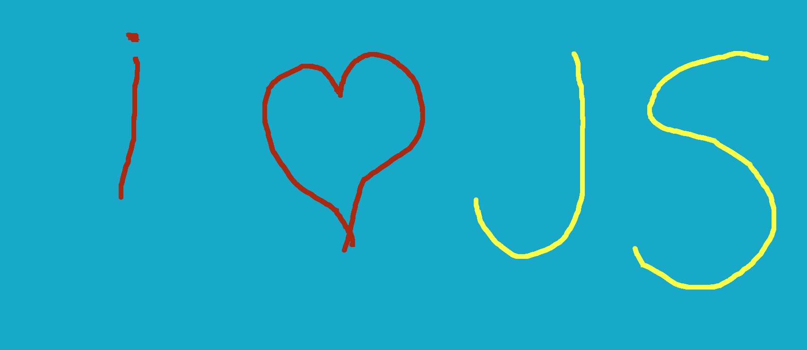

# 🎨 Paint Clone

A simple painting application clone using HTML, CSS, and JavaScript.

## 🚀 Description

This project is a drawing application that allows users to draw on a canvas using various tools such as a brush, eraser, and options to save/load the drawing. Users can also change the brush color and background color, clear the canvas, and download the final image.

## 📸 Screenshot

## 🛠️ Technologies Used

- HTML5
- CSS3
- JavaScript ES6
- [Font Awesome](https://fontawesome.com/) for icons
- [JSColor](https://jscolor.com/) for the color picker

## 📚 Features

- **Brush**: Change the brush size and color
- **Eraser**: Erase parts of the drawing
- **Change Background Color**: Modify the canvas background color
- **Clear Canvas**: Clear the entire canvas
- **Save to Local Storage**: Save the drawing to local storage
- **Load from Local Storage**: Load the drawing from local storage
- **Download Image**: Download the drawing as a JPEG image

# Use the toolbar at the top to select your desired tools and options.
# Press and hold the mouse button to draw on the canvas.
# Use the save button to save your drawing to local storage.
# Use the load button to load a previously saved drawing.
# Use the download button to save your drawing as a JPEG image on your device.
